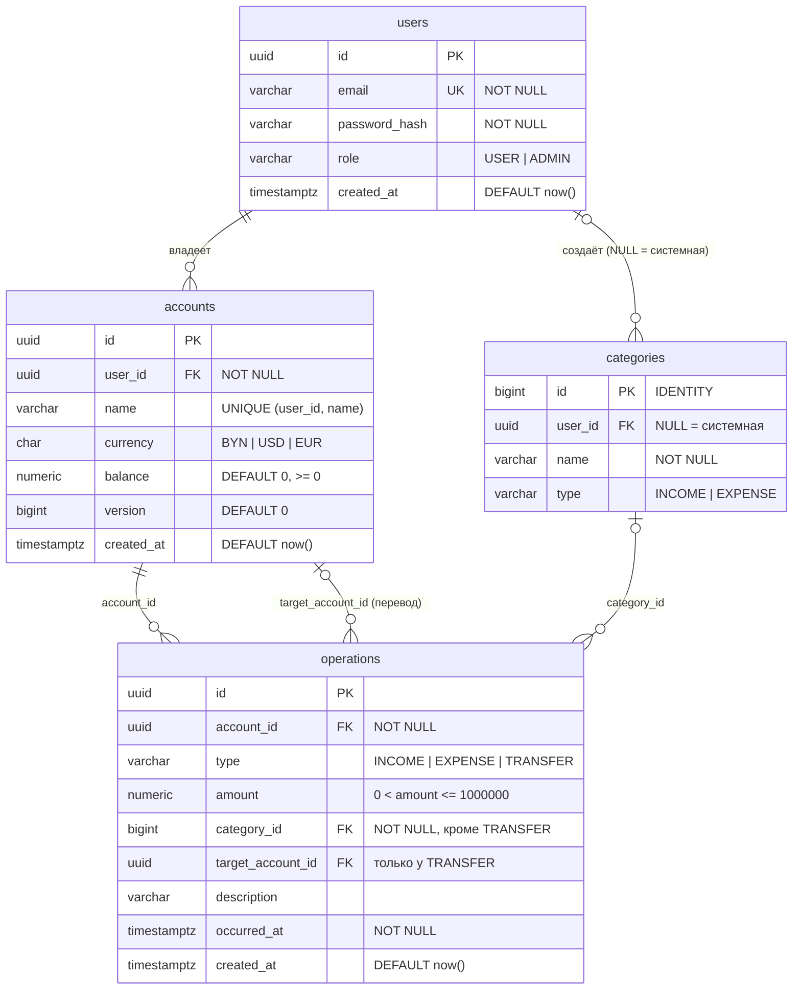

# ER-диаграмма

```mermaid
erDiagram
    users ||--o{ accounts : "владеет"
    users |o--o{ categories : "создаёт (NULL = системная)"
    accounts ||--o{ operations : "account_id"
    accounts |o--o{ operations : "target_account_id (перевод)"
    categories |o--o{ operations : "category_id"

    users {
        uuid id PK
        varchar email UK "NOT NULL"
        varchar password_hash "NOT NULL"
        varchar role "USER | ADMIN"
        timestamptz created_at "DEFAULT now()"
    }

    accounts {
        uuid id PK
        uuid user_id FK "NOT NULL"
        varchar name "UNIQUE (user_id, name)"
        char currency "BYN | USD | EUR"
        numeric balance "DEFAULT 0, >= 0"
        bigint version "DEFAULT 0"
        timestamptz created_at "DEFAULT now()"
    }

    categories {
        bigint id PK "IDENTITY"
        uuid user_id FK "NULL = системная"
        varchar name "NOT NULL"
        varchar type "INCOME | EXPENSE"
    }

    operations {
        uuid id PK
        uuid account_id FK "NOT NULL"
        varchar type "INCOME | EXPENSE | TRANSFER"
        numeric amount "0 < amount <= 1000000"
        bigint category_id FK "NOT NULL, кроме TRANSFER"
        uuid target_account_id FK "только у TRANSFER"
        varchar description
        timestamptz occurred_at "NOT NULL"
        timestamptz created_at "DEFAULT now()"
    }
```

`categories` уникальна по `(user_id, name, type)` с `NULLS NOT DISTINCT`, поэтому
у системных категорий (`user_id IS NULL`) имена в пределах типа тоже не повторяются.
